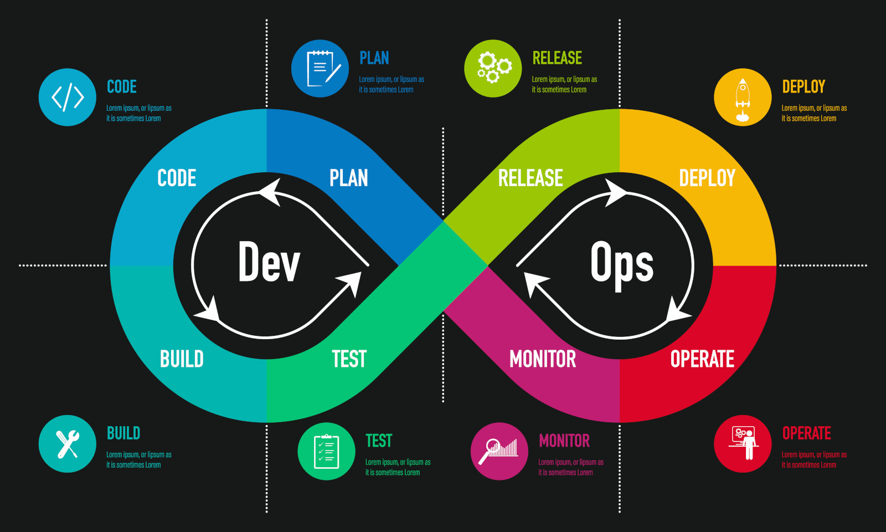

### DevOps is focused on improving workflow between developers and operations. 
### But once the complexity rises, regulating more features and automation to track different DevOps processes is essential. That’s where DevOps monitoring plays a vital role.

#### Importance of DevOps Monitoring
You can use different monitoring tools in DevOps to automate, define, and measure development processes throughout the pipeline.
Monitoring tools are essential because organizations ensure the availability, performance, and overall health of their IT systems and applications.
These tools provide real-time visibility into the performance and behavior of systems, applications, and services, which helps organizations identify and resolve issues before they affect end-users.

###  BrowserStack Test Observability :
BrowserStack Test Observability has been designed specifically for DevOps teams that want to optimize their testing operations with the help of data. It offers valuable insights that can help improve your test suite’s quality, stability, and performance over time. Identifying persistent issues, such as flakiness and constantly failing tests, can help increase the quality of testing and, ultimately, the quality of the end product.

Pros:

#### Some of the core Test Observability Features are:

- Filter real test failures with auto-tagging into flaky test, always-failing, and new failures. No guesswork, repeat reruns.
- Instantly pinpoint failure reasons with AI-based categorizations like product, automation, or environment issues.
- Access every log – framework, video, screenshot, terminal, network & even application logs – chronologically sorted in a single pane.
- Troubleshoot test suite health with built-in dashboards for metrics like stability and flakiness
- Supports major frameworks like Cypress, Playwright, Java TestNG, Webdriver, etc.
- It seamlessly integrates within the CI/CD pipelines (Azure pipelines and Jenkins), providing immediate feedback and enhancing code quality with each deployment.

## WhatsUp

WhatsUp Gold provides complete visibility to everything that’s connected to your network. The unique interactive map lets you see network devices, servers, virtual machines, cloud and wireless environments in context so you can diagnose issues with pinpoint accuracy before end users notice.Its web-based interactive mapping interface lets users see up/down availability and performance at-a-glance for everything connected to a network, on premises and in the cloud.
 

### Why is it important?

WhatsUp Gold enhances your productivity through automation. It can automatically discover anything connected to the network, including physical servers, cloud resources, storage devices, VMware and Hyper-V virtual machines as well as wireless devices. It helps IT admins to view, analyze and manage cross-device connections from a single interactive map.This includes discovery methods, scheduled reports and preconfigured dashboards. This means you are up and running faster and with far more insight from the get-go. Because admins can also monitor application performance and network traffic and manage network device configuration and change control processes, any network activity falling outside of customizable thresholds triggers alerts sent via email, web, SMS or Slack. Alerts can also trigger self-healing actions or PowerShell scripts.
 

 ### Use Cases and Deployment Scope
Progress WhatsUp Gold (formerly Ipswitch WhatsUp Gold) is used to monitor network devices and endpoints and perform reporting and health checks regarding those devices. It allows us to visualize our network and make more informed decisions when troubleshooting or examining performance related issues. We can schedule reports and collect log data. It is a useful tool for administrators.

### Pros and Cons
- The depth of detail collected and accessible
- The interface is clean
- Upgrades are easy and straightforward
- More wizards for beginning the utilization of new functionalities
- The feature depth can be intimidating
### Most Important Features
- Scope of what it can monitor and alert on
- Reporting
- Value to organization compared to other products
### Return on Investment
- Quicker turnaround on seeing/visualizing networking issues
- Alerting on certain types of events make responses quicker
- Support of the product itself is straightforward once set up
### Alternatives Considered
- KACE Asset Management Appliance and Microsoft System Center
Progress WhatsUp Gold (formerly Ipswitch WhatsUp Gold) is more network focused than some of the other products we looked at, which had basic capabilities but were not as strong on the reporting or programmatic resolution of issues. Progress WhatsUp Gold (formerly Ipswitch WhatsUp Gold) is cost effective compared to some of the other upmarket solutions.

# Building & Testing  Tools :
Testing is core to the DevOps model. It is a central strategy for catching bugs early and streamlining the pathway from coding to deployment.

DevOps engineer using DevOps testing tools
Many DevOps teams implement a continuous integration/continuous deployment (CI/CD) approach to automate this process. A strong testing strategy empowers them to constantly deliver new code knowing the updated application has passed all unit and performance tests.

Tests should not only serve as gatekeepers before moving into different phases of the DevOps pipeline but should also be performed continuously. This strategy relies heavily on automation to remove as many manual tasks as possible and expedite execution. When implemented strategically, testing improves the quality and security of deliverables without slowing the momentum of the pipeline.

## AWS CodeDeploy :
.png)
What does the tool do?
 
AWS CodeDeploy is a fully managed deployment service that automates software deployments to various compute services, such as Amazon Elastic Compute Cloud (EC2), Amazon Elastic Container Service (ECS), AWS Lambda, and your on-premises servers. Use CodeDeploy to automate software deployments, eliminating the need for error-prone manual operations.
 
### Why is that an important need?
 
AWS CodeDeploy makes it easier for you to rapidly release new features, helps you avoid downtime during deployment, and handles the complexity of updating your applications.
 
### Identify specific use cases for the tool:
 
1. Automate deployments to remove manual operations
Repeat an application deployment across different groups or instances using a file and command-based install model.
 
1. Deploy to many hosts
Manage deployments to thousands of hosts with advanced monitoring and traffic shifting.
 
1. Use advanced deployment techniques
Support multiple deployment types, including in-place, canary, and blue/green deployments.
 
1. Monitor health and rollback
Configure alarms that will initiate rollbacks, and stop application deployments in progress.

## Jenkins  

Jenkins is an open-source CI server that automates the application build and testing processes. It is written in Java and supported on Windows, Mac, and Unix machines. In addition, Jenkins has a library of hundreds of plugins and supports distributed workloads across multiple machines to improve performance and expedite the testing process.

### Key features and concepts of Jenkins include
1. CI/CD Pipelines: Jenkins enables the creation of CI/CD pipelines, which are sequences of automated steps that define how code changes progress from development to production.
1.  Plugins: Jenkins has a rich ecosystem of plugins that extend its functionality.
1. Freestyle Projects: Jenkins allows you to create freestyle projects, where you manually configure build and deployment steps. It provides flexibility but might require more manual setup.
1. Declarative Pipelines: Jenkins supports declarative pipelines, where you define the pipeline using a domain-specific language (DSL) in a Jenkinsfile. Declarative pipelines offer a more structured and concise way to define complex workflows.
1. Distributed Builds: Jenkins supports distributed builds, allowing you to distribute build jobs across multiple agents (build nodes) to leverage resources efficiently and reduce build times.
1. Integration with Version Control: Jenkins can integrate with various version control systems like Git, Subversion, and Mercurial. It can automatically trigger builds when code changes are committed.
1. Security: Jenkins provides options for securing access to the server, projects, and plugins. You can set up user authentication, role-based access control (RBAC), and manage permissions for different users and groups.
1. Monitoring and Logging: Jenkins offers built-in monitoring and logging capabilities to help track build status, view build logs, and monitor the performance of Jenkins itself.

### Key point :
> Jenkins is written in Java so java installation is mandatory to run Jenkins.

 references :
 https://medium.com/@mesagarkulkarni/devops-tool-jenkins-ci-cd-a942b7b53876#:~:text=Jenkins%20is%20an%20open%2Dsource,code%20changes%20to%20production%20environments.

 https://www.progress.com/network-monitoring#:~:text=WhatsUp%C2%AE%20Gold%20provides%20complete,diagnose%20issues%20with%20pinpoint%20accuracy.

 https://www.browserstack.com/guide/top-devops-monitoring-tools

 